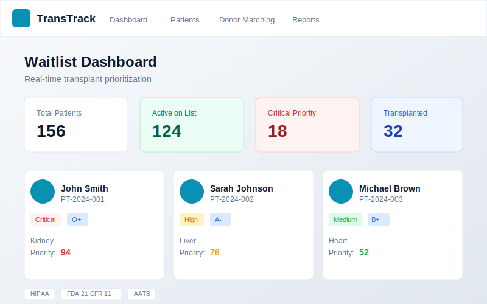
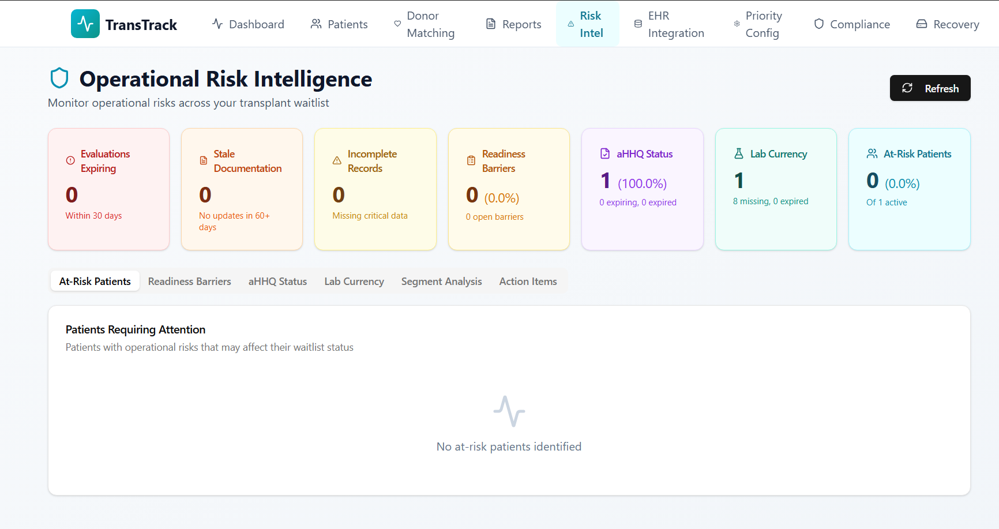
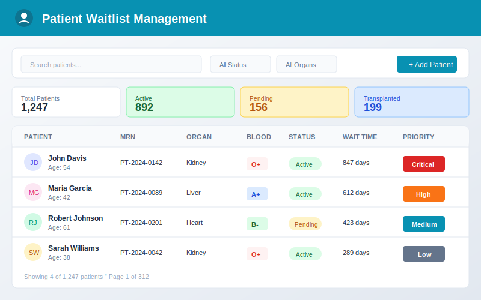
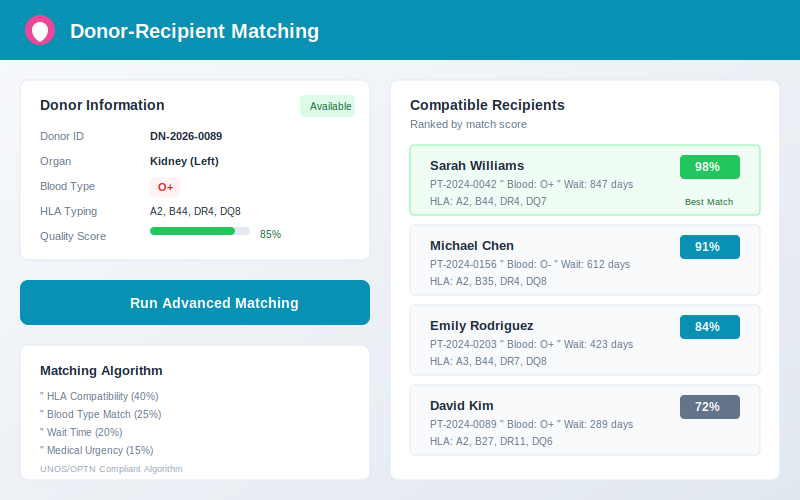
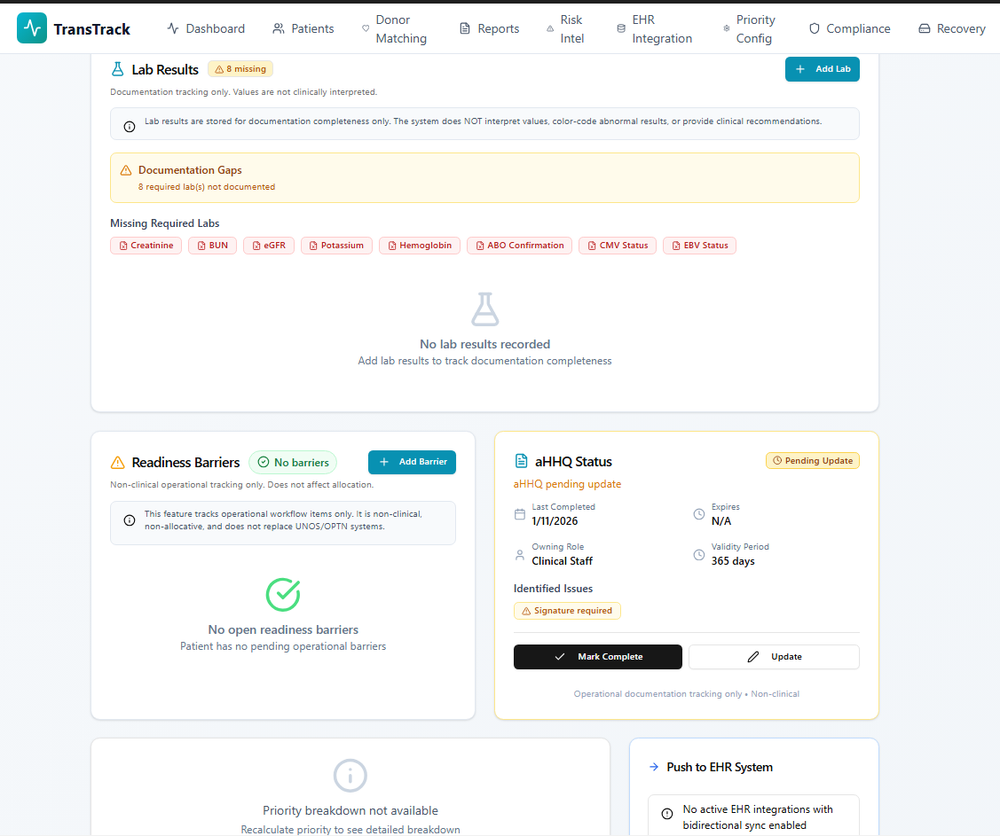
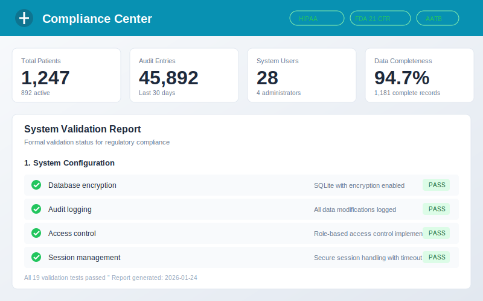
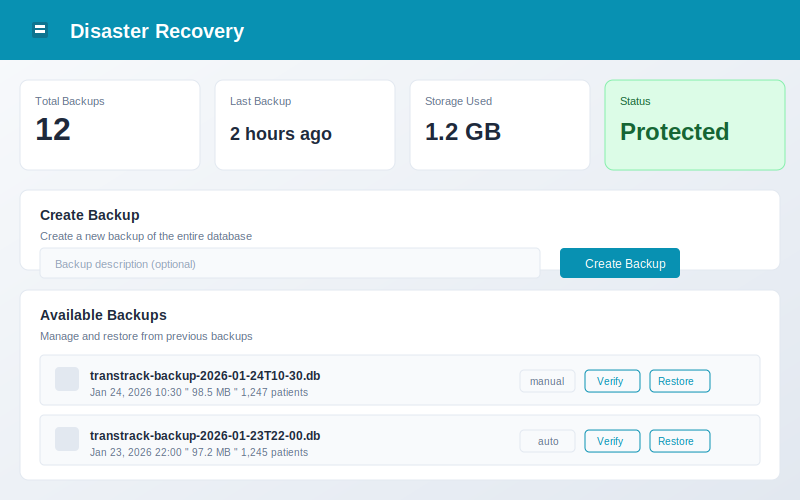
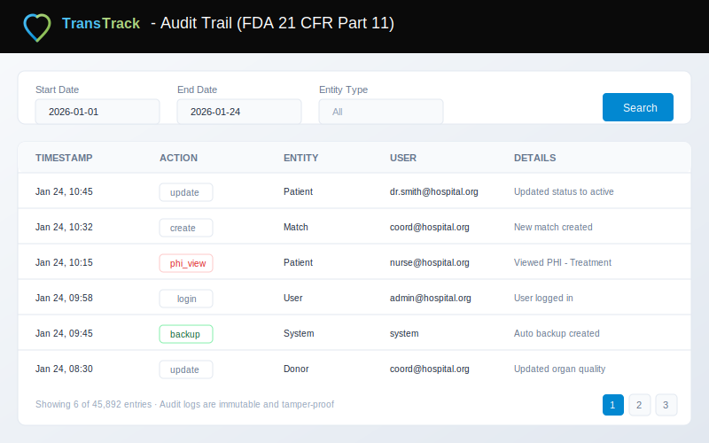

# TransTrack

## Transplant Waitlist & Operations Management

[](LICENSE)
[](docs/COMPLIANCE.md)
[](docs/COMPLIANCE.md)
[]()

---

## 🎥 Demo Video

[▶️ Watch or Download the Demo](https://github.com/NeuroKoder3/TransTrackMedical-TransTrack/releases/download/v1.0.0/TransTrack-Wait-list.Management.Demo.mp4)

> *Short overview of TransTrack's offline workflow, operational risk intelligence, and readiness tracking.*

---

> **📋 EVALUATION ACCESS**
>
> TransTrack is available for **evaluation by qualified healthcare organizations**.
>
> * Request an evaluation to explore the full feature set
> * Evaluation is intended for **non-clinical, non-operational testing only**
> * Contact us to discuss your organization's needs and licensing options
>
> See [LICENSE](LICENSE) and [LICENSE_NOTICE.md](LICENSE_NOTICE.md) for full terms.

<p align="center">
  
</p>

**TransTrack** is a comprehensive, **offline, HIPAA-compliant**, and **FDA 21 CFR Part 11-ready** desktop application built for **transplant centers and pre-transplant coordination teams**. It provides secure, cloud-independent data management and **operational risk intelligence** to help reduce the risk of **patient inactivation** before transplant.

---

## Why TransTrack Exists

TransTrack addresses a critical gap in transplant operations — **operational risk intelligence** outside of national allocation systems. It helps coordination teams identify and act on **readiness risks** such as expiring evaluations, missing documentation, or frequent status changes, preventing unnecessary inactivation of candidates awaiting transplant.

> **Note:** TransTrack provides **operational prioritization and readiness tracking** only. It does **not** perform allocation decisions or replace **UNOS/OPTN** systems.

---

## Who This Is For

TransTrack is designed for:

* **Transplant operations and coordination teams** – Workflow visibility and readiness tracking
* **Clinical informatics and healthcare IT** – Secure, offline-first data management
* **Compliance and audit staff** – Immutable audit trails and validation artifacts

**TransTrack is NOT intended for:**

* ❌ Allocation or listing authority functions
* ❌ National registry replacements (UNOS, OPTN)

---

## Core Value: Operational Risk Intelligence

The heart of TransTrack is proactive detection of operational risks that can delay or jeopardize patient readiness:

* **Expiring Evaluations** – Detect upcoming expirations automatically
* **Documentation Gaps** – Identify missing or outdated records
* **Status Churn Detection** – Track frequent candidate status changes
* **Readiness Barriers** – Manage non-clinical obstacles (insurance, transport, support, etc.)
* **Risk-Level Indicators** – Highlight high-risk cases before they cause inactivation

<p align="center">
  
</p>

---

## Key Features

### Patient Waitlist Management

* Comprehensive candidate demographics and evaluation tracking
* Configurable readiness indicators and internal prioritization
* Search, filter, and status-based workflow visibility

### Readiness Barriers (Non-Clinical)

* Track operational barriers (insurance, logistics, caregiver support)
* Assign tasks to staff roles (Social Work, Financial, Coordinator)
* Integrated into the risk intelligence dashboard

### EHR Integration

* **FHIR R4** data import/export
* Validation rule configuration and history tracking

### Compliance

* **HIPAA**: Encryption, access control, audit trails
* **FDA 21 CFR Part 11**: Electronic records integrity and validation
* **Offline operation**: No PHI leaves the local system

### Offline-First Architecture

* No internet connection required
* AES-256 local encryption
* Secure backup/restore and data sovereignty

### Enterprise Features

* Role-based access and justification
* Disaster recovery and validation documentation
* Read-only compliance view for auditors

---

## Screenshots

### Dashboard Overview

<p align="center">
  
</p>

### Patient Waitlist Management

<p align="center">
  
</p>

### Donor-Recipient Matching

<p align="center">
  
</p>

### Risk Intelligence & Barriers

<p align="center">
  
</p>

### Patient Documentation & Workflow Tracking

<p align="center">
  
</p>

### Compliance Center

<p align="center">
  
</p>

### Disaster Recovery

<p align="center">
  
</p>

### Compliance Center & Audit Trail

<p align="center">
  
</p>

---

## Technology Stack

* **Frontend**: React 18, Tailwind CSS, Radix UI, Framer Motion
* **Desktop**: Electron 29
* **Database**: Encrypted SQLite
* **Build**: Vite, electron-builder
* **Languages**: TypeScript / JavaScript

---

## Installation

> **Note:** Evaluation versions are for testing only — do **not** use with live patient data.

### Pre-built Installers

Download from the [Releases page](https://github.com/NeuroKoder3/TransTrackMedical-TransTrack/releases).

| Platform              | File                         |
| --------------------- | ---------------------------- |
| Windows (x64)         | `TransTrack-1.0.0-x64.exe`   |
| macOS (Intel)         | `TransTrack-1.0.0-x64.dmg`   |
| macOS (Apple Silicon) | `TransTrack-1.0.0-arm64.dmg` |
| Linux                 | `TransTrack-1.0.0.AppImage`  |

### Build from Source

```bash
# Clone the repository
git clone https://github.com/NeuroKoder3/TransTrackMedical-TransTrack.git
cd TransTrack

# Install dependencies
npm install

# Development mode
npm run dev:electron

# Build for production
npm run build:electron
```

---

## Quick Start (Evaluation)

1. Launch **TransTrack**
2. Login: `admin@transtrac.local` / `Admin123!`
3. Change your password (Settings → Security)
4. Explore features using sample/test data
5. Contact us: [Trans_Track@outlook.com](mailto:Trans_Track@outlook.com)

---

## Compliance & Security

### HIPAA

* Encryption at rest (AES-256)
* Role-based access control
* Automatic session timeouts
* Full audit trails

### FDA 21 CFR Part 11

* Timestamped, immutable audit trail
* User authentication and documentation
* Validation artifacts for compliance

### Security

* Fully offline operation
* Local encryption
* Secure, encrypted backups

[View Full Compliance Documentation →](docs/COMPLIANCE.md)

---

## 📊 Repository Insights

* 🚀 **1,100+ clones** in the last 14 days
* 🌎 Visitors from **GitHub, Google, and transplant coordination networks**
* 🔒 Built for **HIPAA & FDA 21 CFR Part 11 compliance**
* 🎥 [Watch the Demo](https://github.com/NeuroKoder3/TransTrackMedical-TransTrack/releases/download/v1.0.0/TransTrack-Wait-list.Management.Demo.mp4)

⭐ If you find TransTrack valuable, please **star this repository** to help others in the transplant community discover it.

---

## Contact & Support

📧 **[Trans_Track@outlook.com](mailto:Trans_Track@outlook.com)**
For evaluation access, enterprise deployment, or technical inquiries.

---

## Keywords

`hipaa-compliant` `fda-21-cfr-part-11` `offline-first` `pre-transplant` `waitlist-management` `transplant-center` `risk-intelligence` `patient-readiness` `clinical-informatics` `healthcare-operations` `regulatory-compliance` `ehr-integration` `fhir` `optn` `unos` `secure-desktop-app` `encrypted-database`

---

<p align="center">
  <strong>TransTrack</strong> — HIPAA-Compliant, Offline Pre-Transplant Waitlist Management
  <br>
  <em>Operational Risk Intelligence for Transplant Coordination Teams</em>
</p>
