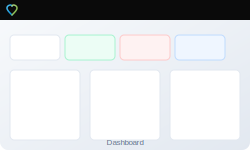
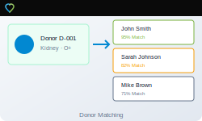
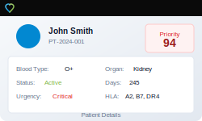

# TransTrack

## Transplant Waitlist Management System

[](LICENSE)
[](PRICING.md)
[](docs/COMPLIANCE.md)
[](docs/COMPLIANCE.md)
[](docs/COMPLIANCE.md)
[]()

<p align="center">
  
</p>

**TransTrack** is a comprehensive, **fully offline**, **HIPAA-compliant** desktop application for managing organ transplant waitlists. Built with modern technologies and designed for transplant centers, hospitals, and tissue banks that require regulatory compliance without cloud dependencies.

---

## Key Features

### Patient Waitlist Management
- Complete patient demographics and medical history
- Automated priority scoring based on UNOS-aligned algorithms
- Real-time waitlist status tracking
- Comprehensive patient search and filtering

### Advanced Donor Matching
- Intelligent donor-recipient compatibility matching
- Blood type compatibility verification
- HLA typing and matching analysis
- Virtual crossmatch simulation
- Predicted graft survival calculations

### Priority Calculation Engine
- **MELD Score** integration for liver transplants
- **LAS Score** integration for lung transplants
- **PRA/CPRA** tracking for kidney transplants
- Configurable weighting algorithms
- Time-on-waitlist considerations
- Medical urgency factoring

### EHR Integration
- **FHIR R4** data import/export
- Patient data synchronization
- Validation rule management
- Import history tracking

### Regulatory Compliance
- **HIPAA** - Full technical safeguard implementation
- **FDA 21 CFR Part 11** - Electronic records compliance
- **AATB Standards** - Tissue banking requirements
- Immutable audit trails
- Role-based access control

### Offline-First Architecture
- **No internet connection required**
- Local encrypted database (AES-256)
- Complete data sovereignty
- Secure backup/restore capabilities

---

## Screenshots

| Dashboard | Donor Matching | Patient Details |
|-----------|----------------|-----------------|
|  |  |  |

---

## Technology Stack

- **Frontend**: React 18, Tailwind CSS, Radix UI, Framer Motion
- **Desktop**: Electron 29
- **Database**: SQLite with encryption
- **Build**: Vite, electron-builder
- **Languages**: JavaScript/TypeScript

---

## Installation

### Pre-built Installers

Download the latest release for your platform:

| Platform | Download |
|----------|----------|
| Windows (x64) | [TransTrack-1.0.0-x64.exe](../../releases) |
| macOS (Intel) | [TransTrack-1.0.0-x64.dmg](../../releases) |
| macOS (Apple Silicon) | [TransTrack-1.0.0-arm64.dmg](../../releases) |
| Linux | [TransTrack-1.0.0.AppImage](../../releases) |

### Build from Source

```bash
# Clone the repository
git clone https://github.com/TransTrackMedical/TransTrack.git
cd TransTrack

# Install dependencies
npm install

# Development mode
npm run dev:electron

# Build for production
npm run build:electron
```

---

## Quick Start

1. **Launch TransTrack** from your applications menu
2. **Login** with default credentials:
   - Email: `admin@transtrack.local`
   - Password: `admin123`
3. **Change your password** immediately (Settings → Security)
4. **Add patients** to your waitlist
5. **Register donors** when organs become available
6. **Run matching** to find compatible recipients

---

## System Requirements

### Minimum Requirements
- **OS**: Windows 10, macOS 10.14, Ubuntu 18.04
- **RAM**: 4 GB
- **Storage**: 500 MB free space
- **Display**: 1024 x 768 resolution

### Recommended
- **OS**: Windows 11, macOS 12+, Ubuntu 22.04
- **RAM**: 8 GB
- **Storage**: 2 GB free space
- **Display**: 1920 x 1080 resolution

---

## Compliance & Security

TransTrack is designed for healthcare environments requiring strict regulatory compliance:

### HIPAA Technical Safeguards
- ✅ Encryption at rest (AES-256)
- ✅ Unique user identification
- ✅ Role-based access control
- ✅ Automatic session timeout
- ✅ Complete audit trails
- ✅ No network transmission of PHI

### FDA 21 CFR Part 11
- ✅ Electronic records integrity
- ✅ Audit trail with timestamps
- ✅ User authentication
- ✅ System documentation

### Data Security
- All patient data encrypted locally
- No cloud storage or transmission
- Secure backup capabilities
- Complete data sovereignty

[View Full Compliance Documentation →](docs/COMPLIANCE.md)

---

## Documentation

- [User Guide](docs/USER_GUIDE.md)
- [Compliance Documentation](docs/COMPLIANCE.md)
- [API Reference](docs/API.md)
- [Development Guide](docs/DEVELOPMENT.md)

---

## Use Cases

### Transplant Centers
- Manage multi-organ waitlists
- Coordinate donor matching
- Generate UNOS-compatible reports

### Hospitals
- Track transplant candidates
- Interface with existing EHR systems
- Maintain regulatory compliance

### Tissue Banks
- Donor registration and tracking
- Quality documentation
- Chain of custody management

### Research Institutions
- De-identified data analysis
- Outcome tracking
- Algorithm development

---

## Roadmap

### Version 1.1
- [ ] Multi-organ transplant support
- [ ] Advanced reporting dashboard
- [ ] Custom priority algorithm builder
- [ ] Batch patient import

### Version 1.2
- [ ] Secure multi-user sync (optional)
- [ ] Mobile companion app
- [ ] Extended FHIR support
- [ ] HL7 integration

---

## Contributing

We welcome contributions! Please see our [Contributing Guide](CONTRIBUTING.md) for details.

### Development Setup

```bash
# Install dependencies
npm install

# Start development server
npm run dev

# Run Electron in development
npm run dev:electron

# Run tests
npm test

# Lint code
npm run lint
```

---

## Pricing & Licensing

TransTrack is commercial software requiring a paid license for use.

| License | Price | Installations | Support |
|---------|-------|---------------|---------|
| **Starter** | $2,499 | 1 workstation | Email (48hr) |
| **Professional** | $7,499 | Up to 5 | Priority (24hr) |
| **Enterprise** | $24,999 | Unlimited | 24/7 Phone & Email |

### [View Full Pricing Details →](PRICING.md)

**Discounts Available:**
- Nonprofit organizations: 25% off
- Academic institutions: 40% off
- Multi-year commitments: Volume pricing

📧 **NicMGildehaus83@outlook.com**

### Request a Demo

Interested in seeing TransTrack in action? Schedule a personalized demo:

📧 **NicMGildehaus83@outlook.com**

### 14-Day Evaluation

Qualified healthcare organizations can request a free 14-day evaluation license.

---

## Support

### Sales & Licensing
📧 NicMGildehaus83@outlook.com

### Technical Support (Licensed Customers)
📧 NicMGildehaus83@outlook.com

### Enterprise Solutions
Custom integrations, training, and dedicated support:
📧 NicMGildehaus83@outlook.com

### Pre-Sales Questions
- [GitHub Discussions](../../discussions)
- [Request a Demo](mailto:NicMGildehaus83@outlook.com)

---

## Keywords

`transplant` `organ-transplant` `waitlist-management` `HIPAA` `FDA` `AATB` `UNOS` `medical-software` `healthcare` `EHR` `FHIR` `donor-matching` `organ-matching` `clinical-software` `hospital-software` `tissue-banking` `transplant-center` `organ-procurement` `patient-management` `healthcare-IT` `electron` `offline-first` `encrypted-database` `compliance` `regulatory` `medical-records`

---

<p align="center">
  <strong>TransTrack</strong> - Secure, Compliant, Offline Transplant Management
  <br>
  <em>Saving lives through better technology</em>
</p>
